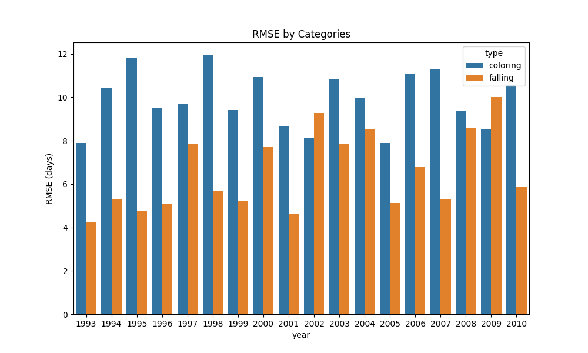

# Project 3: Fall foliage!

### Author: Vedaant Kuchhal

## Aim
The aim of this project is to model the changing color and shedding the leaves of a select deciduous tree species in the fall, or autumn season.

## Background
The changing color of leaves in certain deciduous tree species bring about the gorgeous "fall colors" that New England in the USA is famous for, as well as as a few other temperate regions of the world. While millions around the world experience this surreal phenomenon, scientific research knows surprisingly little about the reasons behind why this occurs in the first place 

While the exact mechanism for this changing color, formally known as leaf senescence, remains unclear, numerous models have been presented to explain the factors that trigger this process. It has been ascertained that the process depends on temperature and precipitation - in fact, the process is quite sensitive to these factors. As a result, this area of research is gaining increasing interest as an indicator of climate change. Due to warming temperatures and more erratic weather patterns, the process of leaf senescence has been predicted to be delayed over time.

One model estimates that - based on current climate projections - leaf coloring would delay by up to 1.7 days a decade from the period 1951-2099 in France. This is a mechanistic model that considers just temperature and the photoperiod (i.e. hours of daylight) as two contributing and triggering factors towards both leaf senescence and leaf falling. It's not a very sophisticated model, but it serves as a useful starting point to model senescence at a macro level.

The model in this repository is a replica of that model, parametrized by values calculated by a team of researchers in the USA. It uses temperature from historical weather data as well as calculated photoperiod to predict leaf senscence. Additionally, this model is rigorously benchmarked with data from a dataset from the Harvard Forest.

 ## Code Overview
 ### Pre-requisites
 This project is written entirely in [Python](https://www.python.org/), and three libraries outside of base Python 2.0 or higher are required to run the code in this repository. These are:

  - `time`
  - `datetime`
  - `pandas`
  - `numpy`
  - `matplotlib`
  - `pygame`
  - `seaborn`
  - `openmeteo_requests`

All can be installed appropriately (such as through `pip` - depends on the specific system) if not already present. See directions [here](https://docs.python.org/3/installing/index.html) if needed.

  ### Files
  There are six code files in this repository:

  1. `main.py`: Run code for visualization
  2. `report_benchmarks.py`: Run code for benchmarking calculation and graphing
  3. `tree.py`: Contains the `Tree`, `TreeModel`, and `TreeView` classes for modelling
  4. `temperature.py`: Queries weather API to get historical temperature data
  5. `helpers.py`: Various helper functions for photoperiod calculations and color scaling
  5. `constants.py`: Various constants used in modelling

  ### Running
  There are two options for running the code, one is running `main.py` in your appropriate Python environment (e.g.- entering `python main.py` in a shell).

  The `main.py` file displays the process of senescence over time for a 'forest' of four different tree species (defined in `tree.py`). It creates appropriate instances and maps the calculated senescence value (arbitrary units) to a color scale. The gradual fading out indicates leaf fall.
  
  The `report_benchmarks.py` file is custom-made for benchmarking. While it uses the same tree models in `tree.py`, the models are run until specific threshold values are hit. The day that these values are reached are recorded, and compared with real world data. For example, the day at which 25% of the leaves turn yellow is computed and compared with the recorded value. The Root Mean Square Error (RMSE) is calculated and plotted. The user is asked for inputs on which categories they want to compare the RMSE value by, which they can enter. Valid categories are `species`, `type`, `year`, `percent`.

## Results
Just as with running, results can be broadly split into two groups: benchmarking and visualization.

### Benchmark comparison
In terms of benchmarking, my implementation of the mechanistic model has a pretty large RMSE. This error appears to be larger for modelling leaf coloring than falling, as seen in the figure below.

Plot of RMSE by phenomenon type over time

You'll notice that the error for coloring, it's around 9-10 days. That's quite high, and this indicates that this model isn't a very accurate one. Possible reasons for inaccuracy are discussed in the Discussion section. 
### Visualization
The benchmarking report might make it seem like all hope is lost, but this is where I want to take a moment to note that my computing skill - and therefore primary focus of this project - was to be about visualizing the changing colors.

The above picture is a screenshot of four different species of 'trees' as they are in the process of changing color. Running `main.py` allows you to see this over time. Notice how the trees are all translucent? That indicates what percentage of leaves have fallen off - it's not a perfect visualization, but for comparison, here's what the same figure looks if the leaf falling is disabled:

Hopefully that looks more familiar! You can clearly see the four different tree species and how they are at different points in the senescence process. This mirrors real life, where different species turn different colors at different times.

## Discussion
As mentioned earlier, the model had a fairly high RMSE when compared with benchmarks. Here are possible reasons for this inaccuracy:

1) The data that I'm benchmarking against is - well, sketchy at best. It was supposedly collected by one person who made judgements about what percentage of, for example, a red maple tree's leaves had fallen off. As a result, the data has room for subjective error, is based on a very narrow set of observation (one set of trees), and cannot be independently verified.

2) The model being used doesn't account for precipitation, an important factor that probably varied quite a bit between different years. The calculation for senscence rate only takes two factors into account and varies between species.

3) The model itself is quite crude - it doesn't have a measure for leaf senescence, instead using arbitrary units. These units are different between species (e.g.- if one tree is at 200 units, it could be mostly yellow, while a different species at 200 units of coloring could be 25% yellow). Lack of scientific consensus on the best way to qualitatively measure "leaf coloring" makes it difficult to cross-check results.

At the same time, the model provided a compelling visual story by showing the progression of fall foliage over time. Its  mechanistic nature provides a great starting point for further, more compelling implementations. These could include models that overlay satelite images of forests, predicting how they would change color and lose leaves in the fall. A slightly more advanced version might consider modelling individual individual leaves and including more stochastic elements into the modelling such that effects like leaf fall and color can be more vividly observed.

## Conclusion and Next Steps
On the whole, the implemented model's results are too far from observation data, the observation data is too subjective to be rigorous, and the model's mechanisms are too narrow and cumbersome yet to be used for scientific insight. There are compelling visualization opportunities that can be pursued, but as far as scientific research is concerned, the model is still far too inadequate to be accurate.

With increased refinement and accuracy, however, this model has the power to become powerful, especially to predict and visualize the impacts of climate change.

## References
<a id="1">[1]</a> Delpierre, Nicolas, et al. “Modelling Interannual and Spatial Variability of Leaf Senescence for Three Deciduous Tree Species in France.” Agricultural and Forest Meteorology, vol. 149, no. 6–7, June 2009, pp. 938–48. https://doi.org/10.1016/j.agrformet.2008.11.014.

<a id="2">[2]</a> Archetti, Marco, et al. "Predicting climate change impacts on the amount and duration of autumn colors in a New England forest." PLoS One 8.3 (2013): e57373.

If you made it all the way to the end, thank you for reading!!